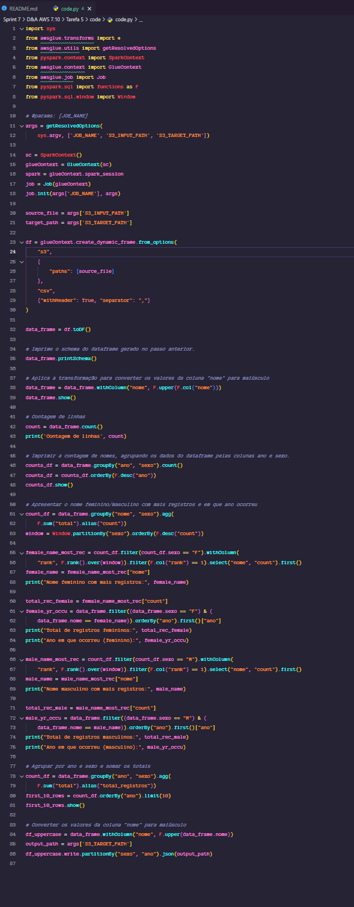
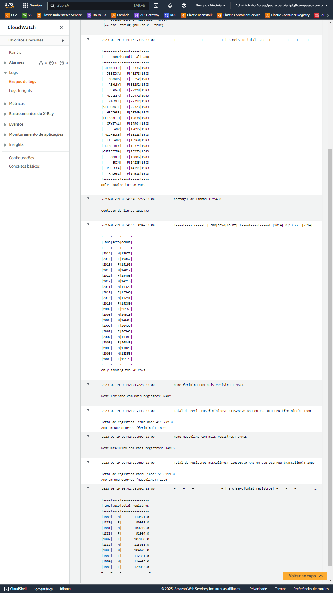

# Textos gerados a partir das tarefas exigidas 🎇

~~~python
import sys
from awsglue.transforms import *
from awsglue.utils import getResolvedOptions
from pyspark.context import SparkContext
from awsglue.context import GlueContext
from awsglue.job import Job
from pyspark.sql import functions as F
from pyspark.sql.window import Window

# @params: [JOB_NAME]
args = getResolvedOptions(
    sys.argv, ['JOB_NAME', 'S3_INPUT_PATH', 'S3_TARGET_PATH'])

sc = SparkContext()
glueContext = GlueContext(sc)
spark = glueContext.spark_session
job = Job(glueContext)
job.init(args['JOB_NAME'], args)

source_file = args['S3_INPUT_PATH']
target_path = args['S3_TARGET_PATH']

df = glueContext.create_dynamic_frame.from_options(
    "s3",
    {
        "paths": [source_file]
    },
    "csv",
    {"withHeader": True, "separator": ","}
)

data_frame = df.toDF()

# Imprime o schema do dataframe gerado no passo anterior.
data_frame.printSchema()

# Aplica a transformação para converter os valores da coluna "nome" para maiúsculo
data_frame = data_frame.withColumn("nome", F.upper(F.col("nome")))
data_frame.show()

# Contagem de linhas
count = data_frame.count()
print('Contagem de linhas', count)

# Imprimir a contagem de nomes, agrupando os dados do dataframe pelas colunas ano e sexo.
counts_df = data_frame.groupBy("ano", "sexo").count()
counts_df = counts_df.orderBy(F.desc("ano"))
counts_df.show()

# Apresentar o nome feminino/masculino com mais registros e em que ano ocorreu
count_df = data_frame.groupBy("nome", "sexo").agg(
    F.sum("total").alias("count"))
window = Window.partitionBy("sexo").orderBy(F.desc("count"))

nome_feminino_mais_registros = count_df.filter(count_df.sexo == "F").withColumn(
    "rank", F.rank().over(window)).filter(F.col("rank") == 1).select("nome", "count").first()
nome_feminino = nome_feminino_mais_registros["nome"]
print("Nome feminino com mais registros:", nome_feminino)

total_registros_feminino = nome_feminino_mais_registros["count"]
ano_ocorrencia_feminino = data_frame.filter((data_frame.sexo == "F") & (
    data_frame.nome == nome_feminino)).orderBy("ano").first()["ano"]
print("Total de registros femininos:", total_registros_feminino)
print("Ano em que ocorreu (feminino):", ano_ocorrencia_feminino)

nome_masculino_mais_registros = count_df.filter(count_df.sexo == "M").withColumn(
    "rank", F.rank().over(window)).filter(F.col("rank") == 1).select("nome", "count").first()
nome_masculino = nome_masculino_mais_registros["nome"]
print("Nome masculino com mais registros:", nome_masculino)

total_registros_masculino = nome_masculino_mais_registros["count"]
print("Total de registros masculinos:", total_registros_masculino)

ano_ocorrencia_masculino = data_frame.filter((data_frame.sexo == "M") & (
    data_frame.nome == nome_masculino)).orderBy("ano").first()["ano"]
print("Nome feminino com mais registros:", nome_feminino)
print("Ano em que ocorreu (masculino):", ano_ocorrencia_masculino)

# Agrupar por ano e sexo e somar os totais
count_df = data_frame.groupBy("ano", "sexo").agg(
    F.sum("total").alias("total_registros"))
first_10_rows = count_df.orderBy("ano").limit(10)
first_10_rows.show()

# Converter os valores da coluna "nome" para maiúsculo
df_uppercase = data_frame.withColumn("nome", F.upper(data_frame.nome))
output_path = args['S3_TARGET_PATH']
df_uppercase.write.partitionBy("sexo", "ano").json(output_path)
~~~

## Output - Spark DataFrame:
>
root
 |-- nome: string (nullable = true)
 |-- sexo: string (nullable = true)
 |-- total: string (nullable = true)
 |-- ano: string (nullable = true)

+---------+----+-----+----+
|   nome  |sexo|total| ano|
+---------+----+-----+----+
| JENNIFER|   F|54336|1983|
|  JESSICA|   F|45278|1983|
|   AMANDA|   F|33752|1983|
|   ASHLEY|   F|33292|1983|
|    SARAH|   F|27228|1983|
|  MELISSA|   F|23472|1983|
|   NICOLE|   F|22392|1983|
|STEPHANIE|   F|22323|1983|
|  HEATHER|   F|20749|1983|
|ELIZABETH|   F|19838|1983|
|  CRYSTAL|   F|17904|1983|
|      AMY|   F|17095|1983|
| MICHELLE|   F|16828|1983|
|  TIFFANY|   F|15960|1983|
| KIMBERLY|   F|15374|1983|
|CHRISTINA|   F|15359|1983|
|    AMBER|   F|14886|1983|
|     ERIN|   F|14835|1983|
|  REBECCA|   F|14711|1983|
|   RACHEL|   F|14588|1983|
+---------+----+-----+----+
only showing top 20 rows

Contagem de linhas 1825433

+----+----+-----+
| ano|sexo|count|
+----+----+-----+
|2014|   M|13977|
|2014|   F|19067|
|2013|   M|14012|
|2013|   F|19191|
|2012|   F|19468|
|2012|   M|14216|
|2011|   F|19540|
|2011|   M|14329|
|2010|   M|14241|
|2010|   F|19800|
|2009|   F|20165|
|2009|   M|14519|
|2008|   F|20439|
|2008|   M|14606|
|2007|   M|14383|
|2007|   F|20548|
|2006|   M|14026|
|2006|   F|20043|
|2005|   F|19175|
|2005|   M|13358|
+----+----+-----+
only showing top 20 rows

Nome feminino com mais registros: MARY

Total de registros femininos: 4115282.0
Ano em que ocorreu (feminino): 1880

Nome masculino com mais registros: JAMES
Total de registros masculinos: 5105919.0

Nome feminino com mais registros: MARY
Ano em que ocorreu (masculino): 1880

+----+----+---------------+
| ano|sexo|total_registros|
+----+----+---------------+
|1880|   M|       110491.0|
|1880|   F|        90993.0|
|1881|   M|       100745.0|
|1881|   F|        91954.0|
|1882|   F|       107850.0|
|1882|   M|       113688.0|
|1883|   M|       104629.0|
|1883|   F|       112321.0|
|1884|   M|       114445.0|
|1884|   F|       129022.0|
+----+----+---------------+
