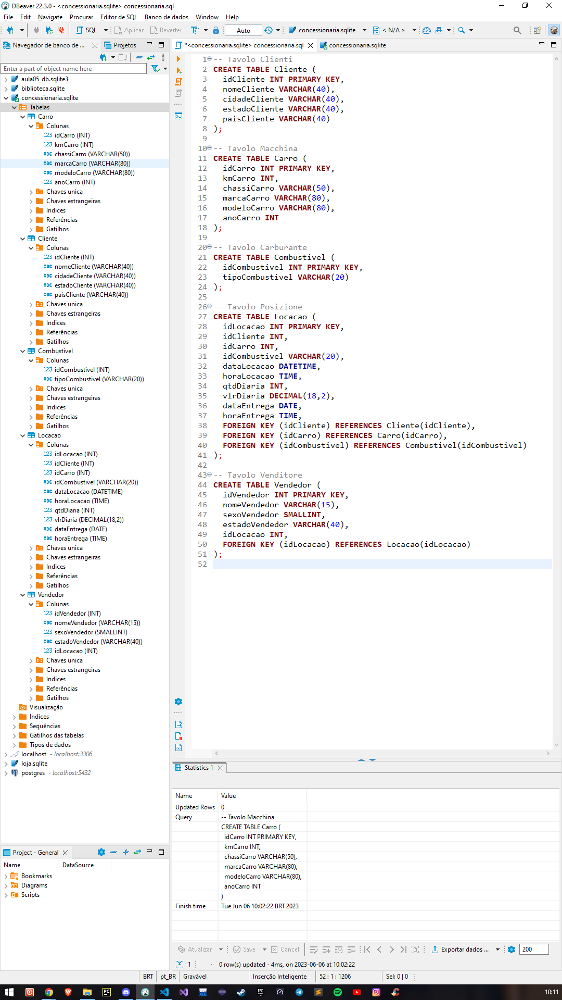
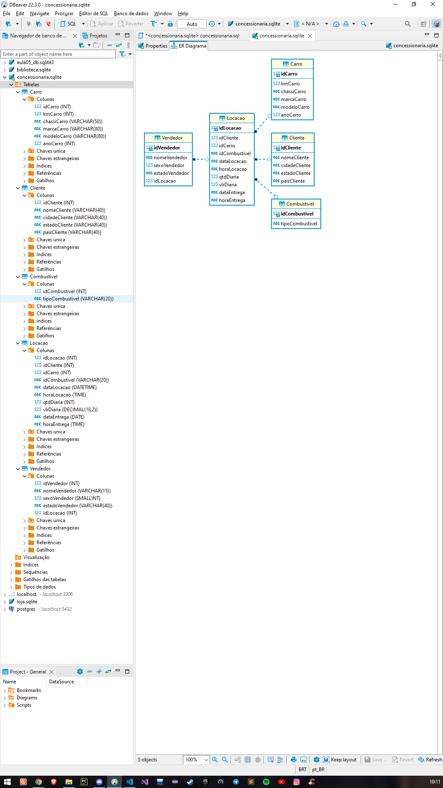

# Tarefa 1: Modelagem Relacional - Normalização
~~~sql

-- Importação dos dados do banco originário `tb_locacao`
INSERT OR IGNORE INTO Cliente (idCliente, nomeCliente, cidadeCliente, estadoCliente, paisCliente)
SELECT idCliente, nomeCliente, cidadeCliente, estadoCliente, paisCliente
FROM tb_locacao;

INSERT OR IGNORE INTO Carro (idCarro, kmCarro, classiCarro, marcaCarro, modeloCarro, anoCarro)
SELECT idCarro, kmCarro, classiCarro, marcaCarro, modeloCarro, anoCarro
FROM tb_locacao;

INSERT OR IGNORE INTO Combustivel (idCombustivel, tipoCombustivel)
SELECT idCombustivel, tipoCombustivel
FROM tb_locacao;

INSERT INTO Locacao (idLocacao, idCliente, idCarro, idCombustivel, dataLocacao, horaLocacao, qtdDiaria, vlrDiaria, dataEntrega, horaEntrega)
SELECT idLocacao, idCliente, idCarro, idCombustivel, dataLocacao, horaLocacao, qtdDiaria, vlrDiaria, dataEntrega, horaEntrega
FROM tb_locacao;

INSERT OR IGNORE INTO Vendedor (idVendedor, nomeVendedor, sexoVendedor, estadoVendedor, idLocacao)
SELECT idVendedor, nomeVendedor, sexoVendedor, estadoVendedor, idLocacao
FROM tb_locacao;

-- Nesse primeiro comando foi criada a tabela `Cliente`, com as colunas respectivas, tendo a coluna `idCliente` como chave primária.
CREATE TABLE Cliente (
  idCliente INT PRIMARY KEY,
  nomeCliente VARCHAR(40),
  cidadeCliente VARCHAR(40),
  estadoCliente VARCHAR(40),
  paisCliente VARCHAR(40)
);

-- Nessa tabela, foi criada as colunas `idCarro`, `kmCarro`, `chassiCarro`, `marcaCarro`, `modeloCarro` e `anoCarro`, tendo a primeira como chave primária.
CREATE TABLE Carro (
  idCarro INT PRIMARY KEY,
  kmCarro INT,
  chassiCarro VARCHAR(50),
  marcaCarro VARCHAR(80),
  modeloCarro VARCHAR(80),
  anoCarro INT
);

-- Aqui fora criada a tabela combustível, com as duas colunas `idCombustivel` e `tipoCombustivel`, com a primeira coluna sendo primária.
CREATE TABLE Combustivel (
  idCombustivel INT PRIMARY KEY,
  tipoCombustivel VARCHAR(20)
);

-- Na tabela abaixo, foi criada com a intenção de ligar as correspondentes, por meio das chaves estrangeiras. Criadas as colunas respectivas, com a chave primária como `idLocacao`, tem-se as chaves `idCliente`, `idCarro`, `idCombustivel` como referendadas.
CREATE TABLE Locacao (
  idLocacao INT PRIMARY KEY,
  idCliente INT,
  idCarro INT,
  idCombustivel VARCHAR(20),
  dataLocacao DATETIME,
  horaLocacao TIME,
  qtdDiaria INT,
  vlrDiaria DECIMAL(18,2),
  dataEntrega DATE,
  horaEntrega TIME,
  FOREIGN KEY (idCliente) REFERENCES Cliente(idCliente),
  FOREIGN KEY (idCarro) REFERENCES Carro(idCarro),
  FOREIGN KEY (idCombustivel) REFERENCES Combustivel(idCombustivel)
);

-- Já na última tabela (Vendedor), foram criados as respectivas colunas, com chave primária em `idVendedor` e a estrangeira ao final para formar o diagrama relacional correspondente ao exercício proposto.
CREATE TABLE Vendedor (
  idVendedor INT PRIMARY KEY,
  nomeVendedor VARCHAR(15),
  sexoVendedor SMALLINT,
  estadoVendedor VARCHAR(40),
  idLocacao INT,
  FOREIGN KEY (idLocacao) REFERENCES Locacao(idLocacao)
);

~~~

# Output

