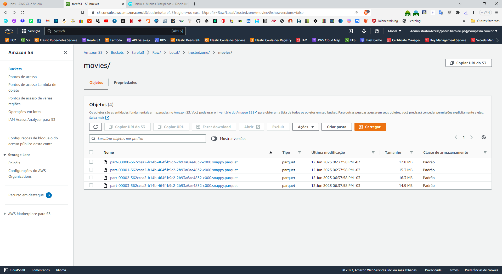
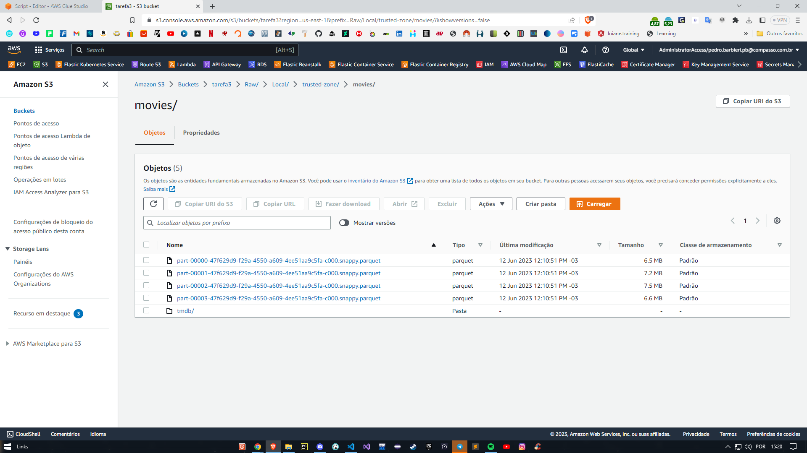
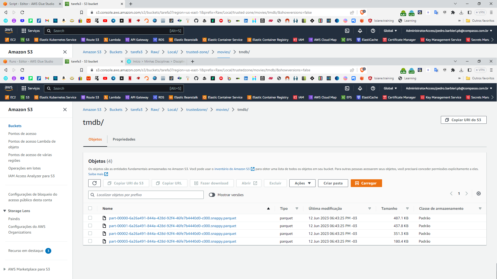

# Tarefa 2:
### Processamento -  Camada Trusted

### Criando a camada Trusted para a carga histórica para o processamento do csv:
~~~python
import sys
from awsglue.transforms import *
from pyspark.sql import SparkSession
from pyspark.sql.functions import col
from awsglue.utils import getResolvedOptions
from pyspark.context import SparkContext
from awsglue.context import GlueContext
from awsglue.job import Job

## @params: [JOB_NAME, S3_INPUT_PATH, S3_TARGET_PATH]
args = getResolvedOptions(sys.argv, ['JOB_NAME', 'S3_INPUT_PATH', 'S3_TARGET_PATH'])

sc = SparkContext()
glueContext = GlueContext(sc)
spark = glueContext.spark_session
job = Job(glueContext)
job.init(args['JOB_NAME'], args)

# Inicializar a sessão Spark
spark = SparkSession.builder.getOrCreate()

# Ler os dados do arquivo CSV
df = spark.read.format("csv").option("header", True).option("inferSchema", True).load(args['S3_INPUT_PATH'])

# Definir o caminho de destino
target_path = args['S3_TARGET_PATH']

# Escrever os dados no formato Parquet
df.write.mode("overwrite").parquet(target_path)

job.commit()
~~~

# Output

### Criando a camada Trusted para a carga de dados:
~~~python
import sys
from awsglue.utils import getResolvedOptions
from awsglue.context import GlueContext
from awsglue.job import Job
from pyspark.context import SparkContext

args = getResolvedOptions(sys.argv, ['JOB_NAME', 'S3_INPUT_PATH', 'S3_TARGET_PATH'])

# Inicializa a sessão Spark e o Glue Context
sc = SparkContext()
glueContext = GlueContext(sc)
spark = glueContext.spark_session
job = Job(glueContext)
job.init(args['JOB_NAME'], args)

# Obtém o diretório de entrada e saída e cria uma pasta de destino com o nome de "tmbd"
input_directory = args['S3_INPUT_PATH']
target_directory = args['S3_TARGET_PATH']+'tmdb/'

# Lê os arquivos .JSON no diretório de entrada, os que possuam "new.json" no nome
input_data = spark.read.json(input_directory + "*new*.json")

# Seleciona as colunas do DataFrame de entrada
processed_data = input_data.select("tituloPrincipal", "tituloOriginal", "anoLancamento", "genero")

# Escreve os dados processados no formato Parquet no diretório
processed_data.write.parquet(target_directory)

job.commit()
~~~

# Output

