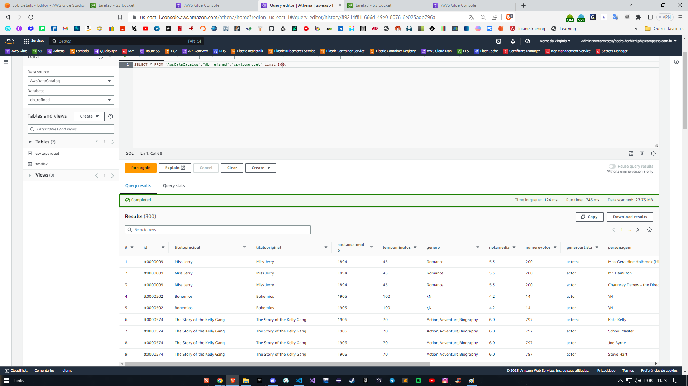

### Tarefa 4:

> Criação do banco de dados com camada refined com o csv em parquet e o json(tmdb) em parquet.

1. Para posterior criação de views, seria necessária a seguinte demanda:

~~~sql
CREATE OR REPLACE VIEW view_movies AS
SELECT c.id, c.titulooriginal AS titulooriginal_csv, c.anolancamento, t.titulopincipal AS tituloprincipal_tmdb, t.notamedia
FROM csvtoparquet c, tmdb2 t;
~~~

2. Para visualização das tabelas:

~~~sql
SELECT DISTINCT anolancamento, COALESCE(titulooriginal_csv, titulopincipal_tmdb) AS tituloprincipal, notamedia
FROM view_movies
WHERE ((CAST(anolancamento AS INTEGER) >= 1990 AND CAST(anolancamento AS INTEGER) <= 1999) OR anolancamento = '\N')
LIMIT 300;
~~~

**SELECT: Especifica as colunas que você deseja selecionar no resultado da consulta.

**DISTINCT: Remove registros duplicados do resultado, garantindo que apenas registros únicos sejam retornados. 

**COALESCE(titulooriginal_csv, tituloprincipal_tmdb) AS tituloprincipal: Utilizamos a função COALESCE para retornar a primeira coluna não nula entre "titulooriginal_csv" e "tituloprincipal_tmdb". Renomeamos o resultado como "tituloprincipal".

  * anolancamento: É a coluna que representa o ano de lançamento do filme.
  * notamedia: É a coluna que representa a nota média do filme.

**FROM: Especifica a tabela ou visualização a partir da qual os dados serão selecionados.

  * view_movies: É o nome da visualização da qual estamos selecionando os dados.

**WHERE: Define as condições para filtrar os registros da tabela ou visualização.
**CAST(anolancamento AS INTEGER): Converte o valor da coluna "anolancamento" para o tipo de dados INTEGER.

  * = 1990 AND <= 1999: Verifica se o valor de "anolancamento" está dentro do intervalo de anos de 1990 a 1999.
  * OR anolancamento = '\N': Verifica se o valor de "anolancamento" é igual a '\N', que representa um valor nulo ou desconhecido.

**LIMIT: Limita o número de linhas exibidas na saída.

  * 300: Exibe até 300 linhas